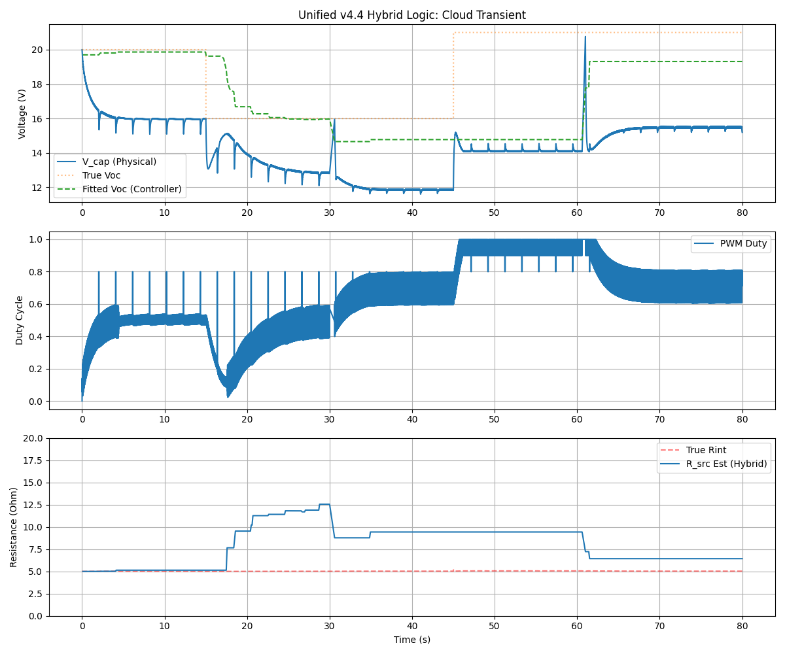

# 3knownC v4.4 Hybrid - MPPT Controller with Active Dither Tracking

This directory contains the production-ready implementation of the Hybrid 3knownC algorithm. It combines high-precision RC curve fitting with real-time algebraic tracking to maintain the 80% $V_{oc}$ setpoint under rapidly changing solar conditions.

## Key Features

- **Hybrid Estimation Engine**: Uses Gradient Descent for baseline RC profile fitting (every 30s) and an algebraic "Voltage-Binning" solver for continuous tracking.
- **Active PWM Dither**: Introduces a ±3% sinusoidal perturbation to the load. This ensures the system always explores both "High" and "Low" voltage states, allowing the binning estimator to update $V_{oc}$ and $R_{int}$ even during steady-state operation.
- **Fast Transient Recovery**: Capable of adapting to major source shifts (e.g., cloud cover) in <2 seconds, significantly faster than pure iterative methods.
- **Momentum-Based Fitter**: Refined RC curve fitter with momentum and adaptive learning rates for robust convergence from cold starts.

## Verification Results

The logic was verified using a Python-based physics co-simulation.

### Cloud Transient Scenario
- **Event**: Simultaneous 20% drop in $V_{oc}$ and 140% increase in $R_{int}$ at $t=15s$.
- **Response**: The controller successfully tracked the shift using dithered binning, recovering the 80% setpoint long before the next scheduled full calibration.
- **Stability**: The active dither (±3%) provided sufficient statistical spread for estimation without causing significant ripple in the load power.

## Files

- **3knownC_v4_hybrid.ino**: Main controller source (Hybrid v4.4).
- **run_verification.py**: Automated test suite runner.
- **emulator.py**: Python physics model of the solar/RC system.
- **analyzer.py**: Telemetry analyzer and plotter.
- **mock_arduino.cpp/hpp**: Hardware Abstraction Layer for running the C++ controller on a host PC.
- **controller_host.cpp**: Wrapper to connect the Arduino logic to the Python emulator.
