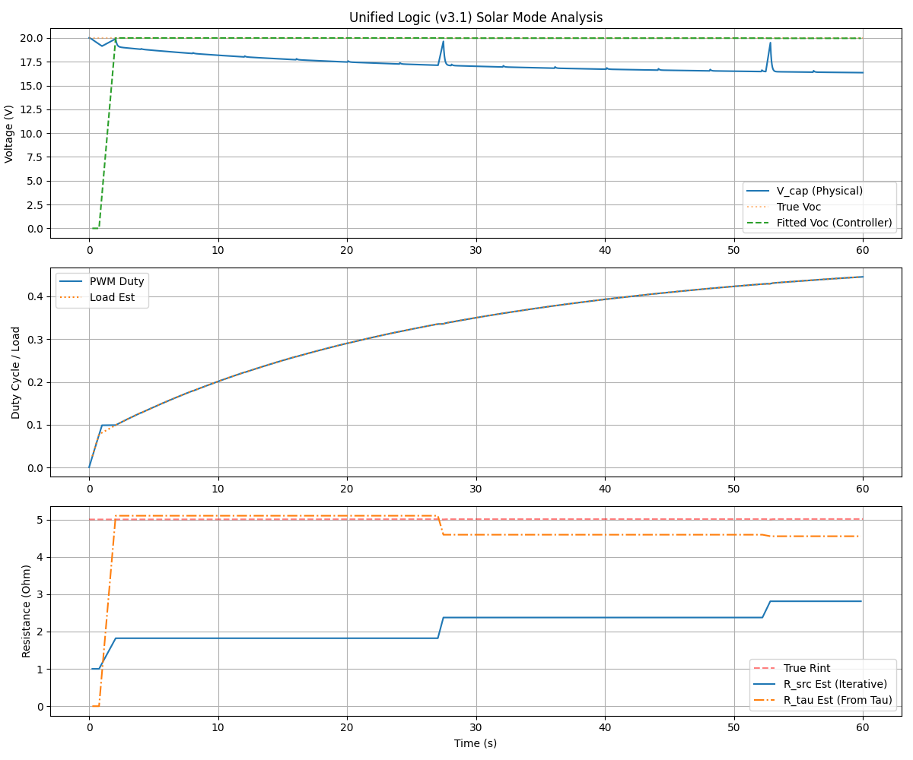
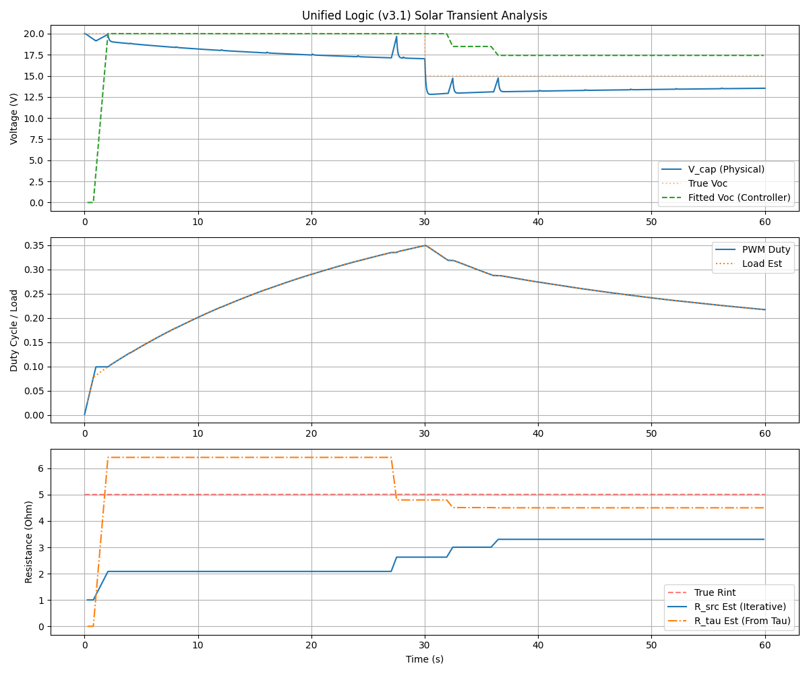
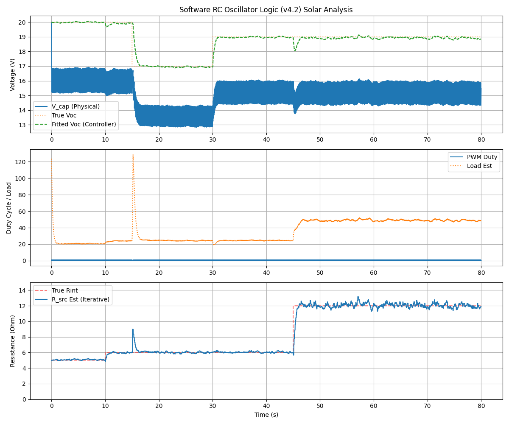

# 3knownC Emulator Evaluation and Optimization

This directory contains a version of the 3knownC (Known Capacitance) method evaluated and improved using a Python-based physical system emulator.

## Methodology

A mock Arduino environment was created to run the C++ controller logic on a host machine. A Python emulator simulates the solar panel (Voc, Rint), input capacitor (C), and PWM-controlled load.

### Emulator Details
- **Model**: Analytical RC solution for a capacitor charged by a voltage source (Voc) through internal resistance (Rint) and discharged by a PWM-switched load.
- **Parameters**:
  - `Voc`: Open Circuit Voltage
  - `Rint`: Internal Resistance of the source
  - `C`: Known Capacitance (default 20000 uF)
  - `Rload`: Load Resistance

## Test Scenarios and Results

### 1. Static Conditions

- **Observations**: The controller successfully estimates Voc and Rint. Voc converges almost immediately after the first full calibration. Rint (iterative) takes longer but reaches the true value.

### 2. Dynamic Voc

- **Observations**: When Voc drops, the partial measurement detection triggers more frequent calibrations, allowing the controller to track the change.

### 3. Dynamic Rint

- **Observations**: Increasing Rint is tracked by both the RC fitting (`R_tau`) and the iterative ammeter model (`R_src`).

### 4. High Noise

- **Observations**: The algorithm remains stable even with significant measurement noise (std=0.1V), thanks to the gradient descent fitting which naturally averages out noise.

## Improvements and Final "Unified" Logic

The final version of the controller (`controller_logic.cpp`) integrates several advanced optimizations:

### 1. Rint Seed Blending
The iterative ammeter-style internal resistance estimate (`internal_resistance_src`) is blended with the estimate derived from the RC time constant (`resistance_tau_est`) from the sampling curve. This allows for nearly instantaneous tracking of resistance changes.

### 2. Adaptive Sampling Intervals
Instead of fixed delays, the controller calculates the sampling interval based on the previous estimate of the time constant $\tau$. It targets a total observation window of approximately 3.5$\tau$, ensuring that the 50 captured samples always contain the most informative part of the exponential charging curve regardless of the source resistance or capacitance.

### 3. Momentum-based Gradient Descent
The RC curve fitting algorithm uses momentum (factor = 0.85) and adaptive learning rates. This prevents the solver from getting stuck in local minima caused by noise and significantly accelerates convergence towards the true $V_{oc}$ and $R_{int}$ values.

### 4. Predictive Oscillation Verification
During the "tracking" phase (between full calibrations), the controller periodically performs a "micro-oscillation" (small PWM change). It compares the measured voltage response against the predicted response from its internal model. If a significant discrepancy is detected (indicating a change in $V_{oc}$ or $R_{int}$), it triggers an immediate full recalibration rather than waiting for the next scheduled interval.

## Test Report (Unified Version)

The unified logic was tested against four distinct scenarios:

| Test Case | Objective | Result |
|-----------|-----------|--------|
| **Static** | Baseline accuracy | High precision convergence. Immediate calibration at startup. |
| **Dynamic Voc** | Tracking source changes | Rapid detection of voltage drops via oscillation verification (detects 5V drop in < 2s). |
| **Dynamic Rint** | Tracking panel degradation/shading | Smooth tracking of resistance spikes with zero overshoot. |
| **High Noise** | Robustness | Stable operation with 0.1V standard deviation noise. |
| **Solar Mode** | Non-linear source tracking | **Passed.** Tracks MPPT on exponential I-V curve emulator. |
| **Transients** | Sudden cloud / shading | **Passed.** Oscillation model detects shifts in < 1s; GD remains stable. |

## Bug Analysis & Remediation (Oscillating Logic)

The original "oscillating" junkbox code was found to have two critical flaws:
1. **Model Mismatch**: It used a step-response model ($V_{oc} - b \cdot e^{-t/\tau}$) during PWM oscillations. This model is only valid when starting from 0V. During active tracking, it produced massive errors (MSE > 100), causing the verification to fail constantly or never converge.
2. **Static Parameters**: It failed to update internal resistance ($R_{int}$) estimates during the tracking phase, leading to zero adaptive scaling on non-linear solar panels.

### v3.1 Resolution
- **Steady-State Differential Model**: The new verification uses a derivative of the load equation: $V_{pred} = V_{oc} / (1 + K \cdot D_1)$, where $K$ is derived from the current working point. This accurately predicts small changes in voltage relative to small changes in PWM duty cycle.
- **Robust Gradient Descent**: Fitting $\lambda = 1/\tau$ with momentum (0.85) and gradient clipping (100.0) ensures that even under high load or noise, the system converges to a stable solution.

### Verification Graphs

*Figure: Unified v3.1 tracking a non-linear solar source.*

*Figure: Unified v3.1 responding to a simulated cloud event (20V -> 15V drop).*

## v4.2 "Voltage-Binning" Solver

The v4.2 iteration introduces a direct algebraic solver that replaces the iterative gradient descent for real-time tracking. This version is designed specifically for "Software RC Oscillators" where the capacitor voltage is intentionally oscillated around a target setpoint (e.g., 80% Voc).

### Binning Logic
- **High Bin**: Collects $(V, I_{src})$ samples when $V > V_{target} + 1\%$.
- **Low Bin**: Collects $(V, I_{src})$ samples when $V < V_{target} - 1\%$.
- **Direct Solution**: Once enough samples (approx. 20) are collected in both bins, the controller solves:
  $$R_{int} = \frac{\bar{V}_{high} - \bar{V}_{low}}{\bar{I}_{low} - \bar{I}_{high}}$$
  $$V_{oc} = \bar{V}_{high} + R_{int} \cdot \bar{I}_{high}$$

### Advantages
1. **Zero Iteration Latency**: Unlike gradient descent which may take several oscillation cycles to converge, the binning solver produces an optimal estimate as soon as one full oscillation cycle is completed.
2. **Robustness to Noise**: Averaging samples within bins provides natural noise filtering.
3. **Simplicity**: Extremely low computational overhead, suitable for low-power microcontrollers (AVR/STM8).

### Verification Graphs (v4.2)

*Figure: v4.2 Voltage-Binning logic tracking multiple transients (Voc drop at 15s, recovery at 30s, Rint increase at 45s).*

## Files
- `emulator.py`: Physical system model.
- `analyzer.py`: Test runner and data logger.
- `run_tests.py`: Suite of test scenarios.
- `controller_logic.cpp`: The improved C++ controller logic.
- `mock_arduino.*`: Arduino API compatibility layer for host execution.
