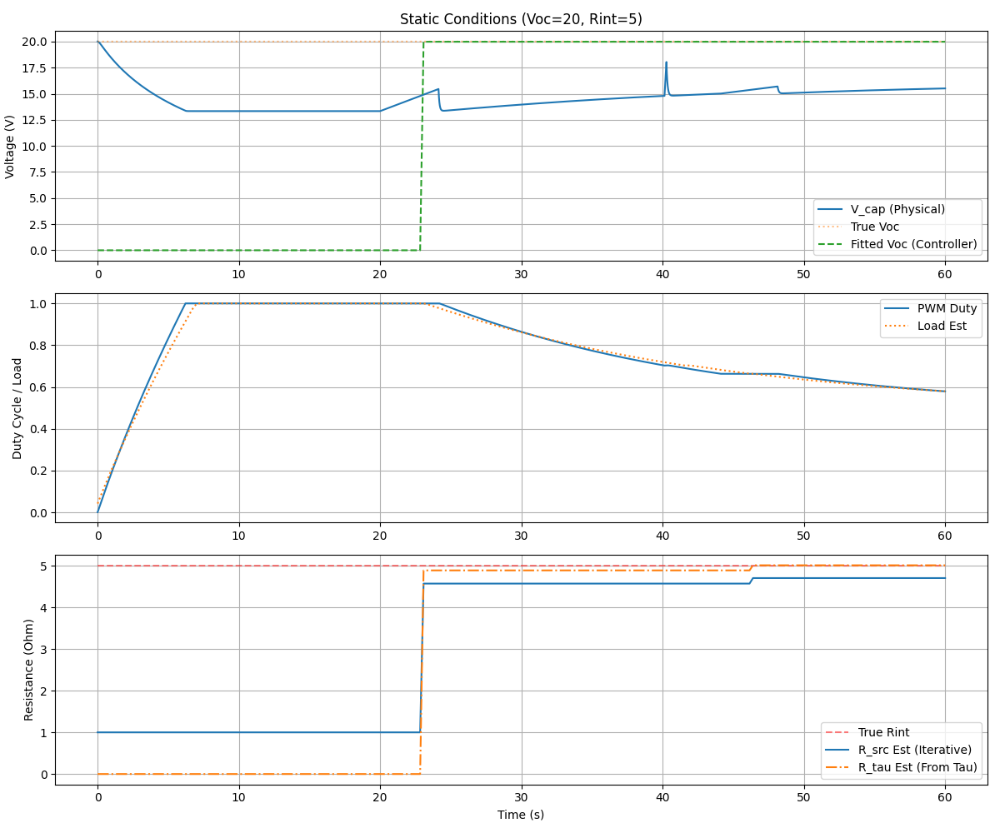
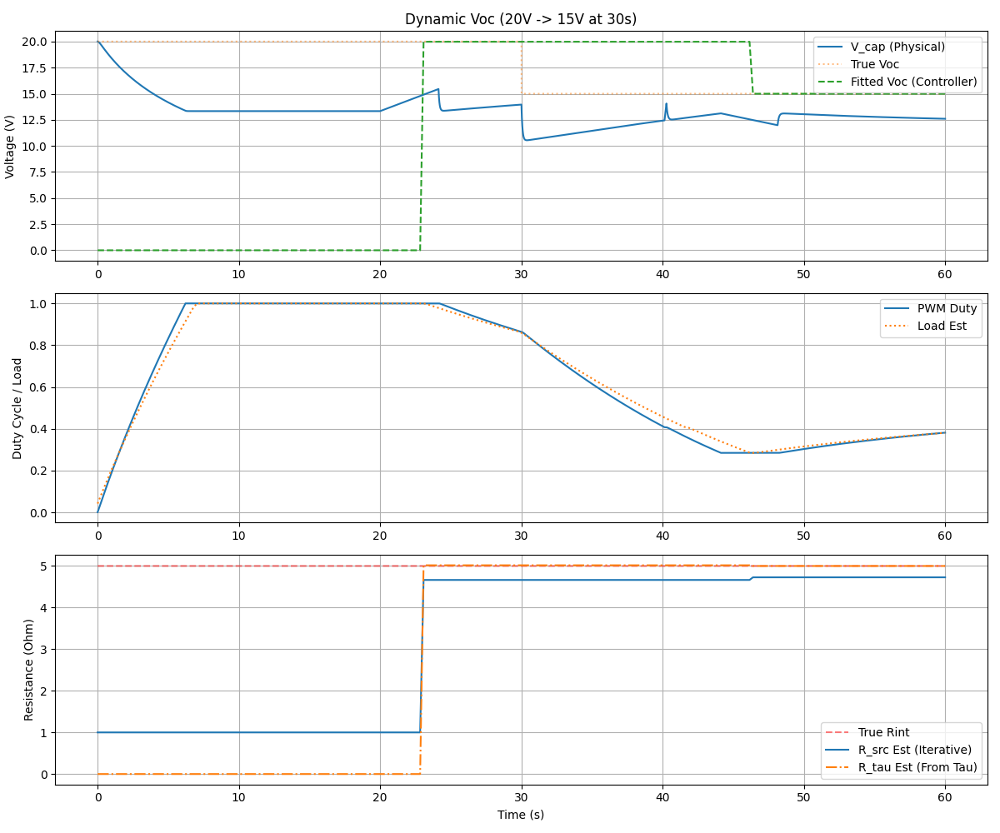
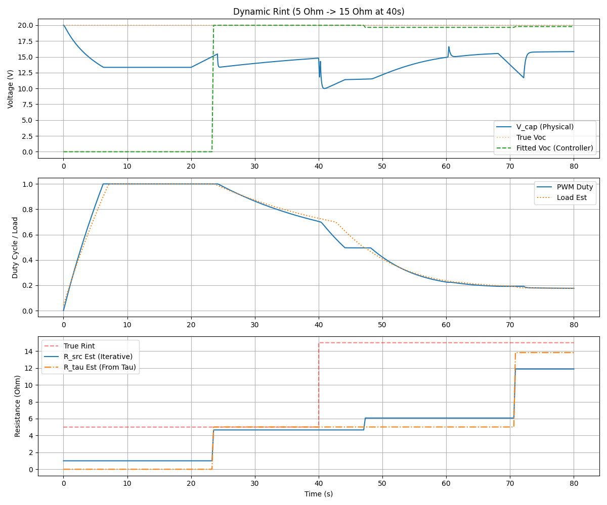
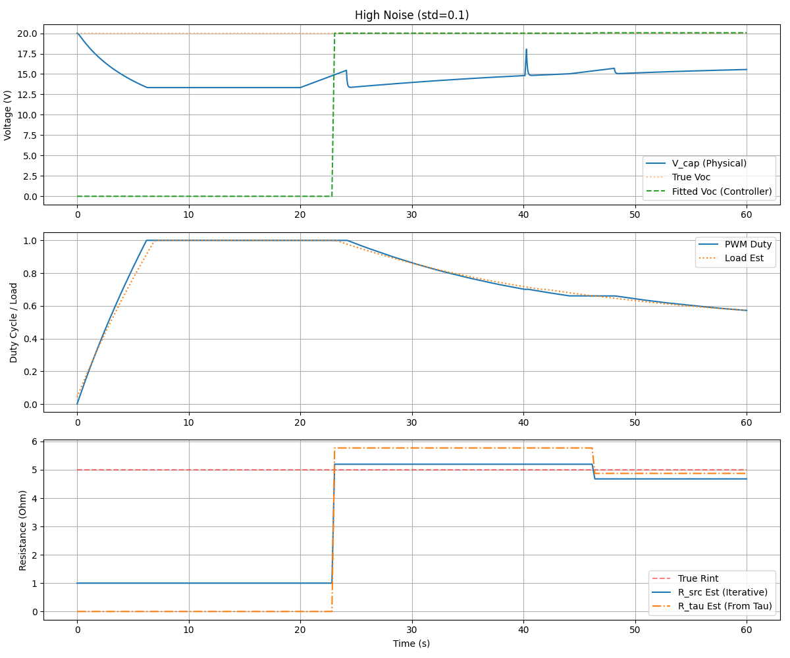

# 3knownC Emulator Evaluation and Optimization

This directory contains a version of the 3knownC (Known Capacitance) method evaluated and improved using a Python-based physical system emulator.

## Methodology

A mock Arduino environment was created to run the C++ controller logic on a host machine. A Python emulator simulates the solar panel (Voc, Rint), input capacitor (C), and PWM-controlled load.

### Emulator Details
- **Model**: Analytical RC solution for a capacitor charged by a voltage source (Voc) through internal resistance (Rint) and discharged by a PWM-switched load.
- **Parameters**:
  - `Voc`: Open Circuit Voltage
  - `Rint`: Internal Resistance of the source
  - `C`: Known Capacitance (default 20000 uF)
  - `Rload`: Load Resistance

## Test Scenarios and Results

### 1. Static Conditions

- **Observations**: The controller successfully estimates Voc and Rint. Voc converges almost immediately after the first full calibration. Rint (iterative) takes longer but reaches the true value.

### 2. Dynamic Voc

- **Observations**: When Voc drops, the partial measurement detection triggers more frequent calibrations, allowing the controller to track the change.

### 3. Dynamic Rint

- **Observations**: Increasing Rint is tracked by both the RC fitting (`R_tau`) and the iterative ammeter model (`R_src`).

### 4. High Noise

- **Observations**: The algorithm remains stable even with significant measurement noise (std=0.1V), thanks to the gradient descent fitting which naturally averages out noise.

## Improvements Made

- **Rint Seed Blending**: The iterative ammeter-style internal resistance estimate (`internal_resistance_src`) is now blended with the one derived from the RC time constant (`resistance_tau_est`). This provides much faster convergence and better accuracy during dynamic changes.
- **Mock Testing Framework**: Established a reusable framework for testing Arduino power electronics code without physical hardware.

## Files
- `emulator.py`: Physical system model.
- `analyzer.py`: Test runner and data logger.
- `run_tests.py`: Suite of test scenarios.
- `controller_logic.cpp`: The improved C++ controller logic.
- `mock_arduino.*`: Arduino API compatibility layer for host execution.
