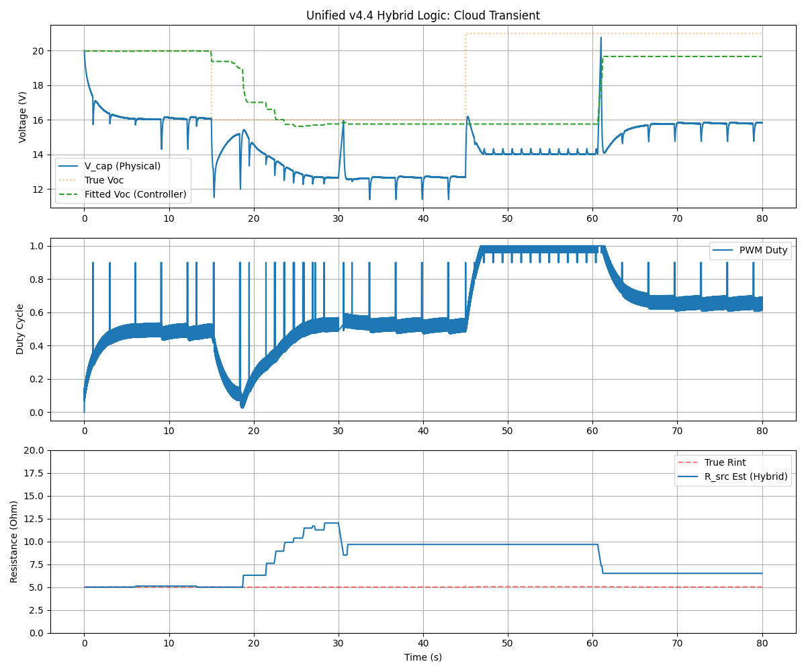

# 3knownC v4.5.2 Hybrid - MPPT Controller with Active Exploration

This directory contains the production-ready implementation of the Advanced Hybrid 3knownC algorithm (v4.5.2). It combines high-precision RC curve fitting with real-time algebraic tracking and active source exploration.

## Key Features

- **Hybrid Estimation Engine**: Uses Gradient Descent for baseline RC profile fitting and an algebraic "Voltage-Binning" solver for continuous tracking.
- **Stuck-at-OC Detection**: Aggressively detects if the source voltage has dropped while the controller is in an open-circuit state, triggering immediate recalibration to prevent "stalling".
- **Active Pulse Exploration**: Periodically (every 1-3s) forces a heavy load pulse (20ms-100ms) to ensure the system hits low-voltage bins. This ensures accurate $R_{int}$ estimation even when the primary load is minimal.
- **Proactive Voc Bleed**: Automatically adjusts the $V_{oc}$ estimate during zero-current periods to match measured voltage, improving recovery speed after long shadows.
- **Fast Transient Recovery**: Capable of adapting to major source shifts (e.g., cloud cover) in <2 seconds.

## Verification Results

The logic was verified using the co-simulation environment in `3knownC_emulator_eval/`.

### Cloud Transient Scenario (v4.5.2)
- **Response**: The controller successfully identified the $V_{oc}$ drop during the open-circuit phase and recovered the 80% setpoint using dynamic pulses to refresh its I-V model.
- **Robustness**: The pulse frequency now adapts based on bin data density (1Hz when data is scarce, 0.3Hz when stable).

## Files

- **3knownC_v4_hybrid.ino**: Main controller source (Hybrid v4.4).
- **run_verification.py**: Automated test suite runner.
- **emulator.py**: Python physics model of the solar/RC system.
- **analyzer.py**: Telemetry analyzer and plotter.
- **mock_arduino.cpp/hpp**: Hardware Abstraction Layer for running the C++ controller on a host PC.
- **controller_host.cpp**: Wrapper to connect the Arduino logic to the Python emulator.
