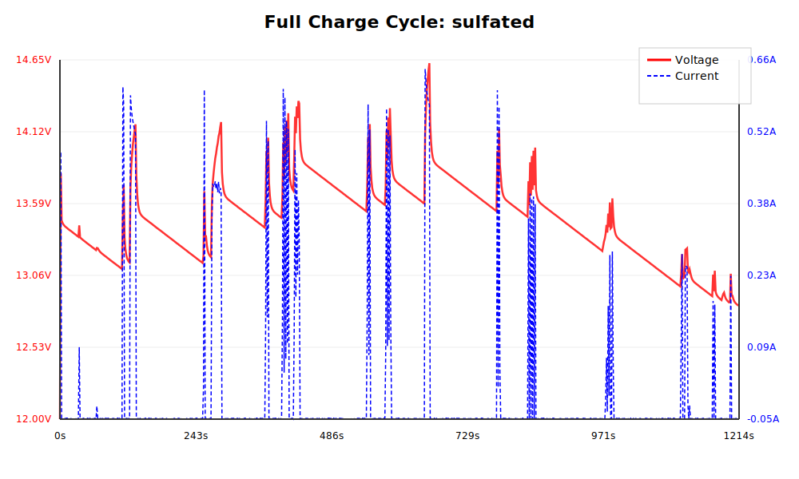
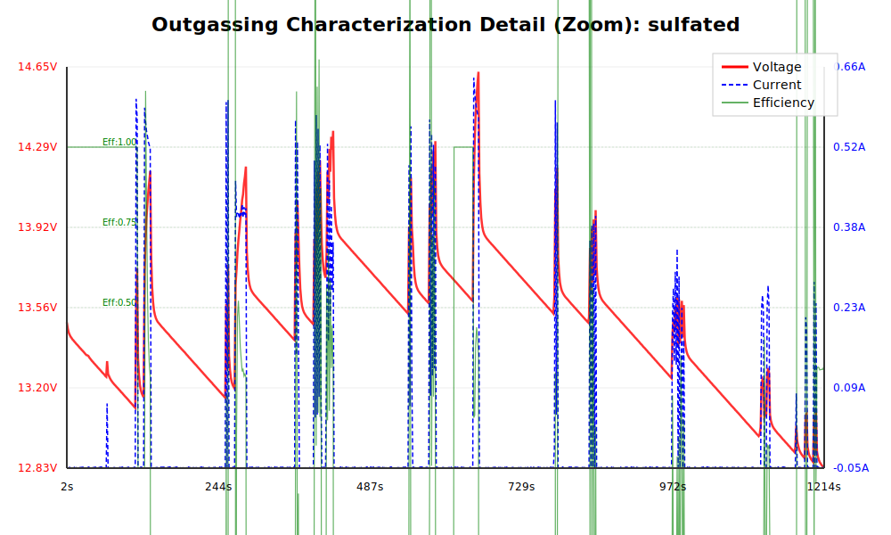
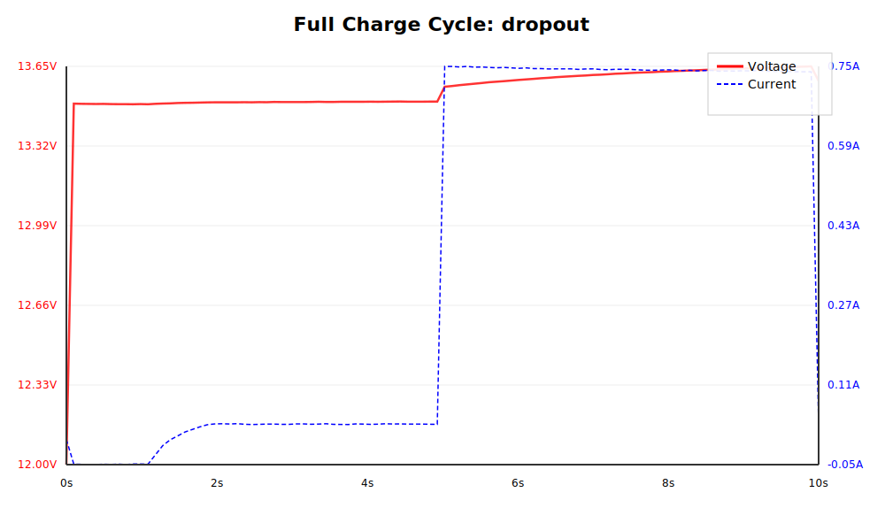
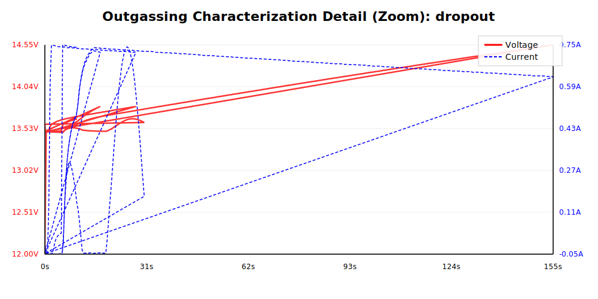

# Outgasser Firmware: Dual-Phase Electrochemical Analysis

This document details the advanced dual-phase outgassing detection system, which distinguishes between reversible and irreversible electrochemical processes in lead-acid batteries.

## Charging Algorithm Flow

The firmware follows a multi-pass state machine to precisely identify the battery's specific electrochemical outgassing point.

### 1. BULK Stage (MODE 5)
- **Goal:** Charge as fast as solar conditions allow using fractional-Voc MPPT.
- **Safety:** "Stall Detection" monitors voltage rise to prevent overcharging failed cells.

### 2. MULTI-PASS CHARACTERIZATION (MODE 2 & 7)
- **Goal:** Physical signature identification of the outgassing knee.
- **Process:** The firmware performs consecutive passes of the following:
    - **Parasitic measurement:** Holds voltage above idle to establish a current baseline (lower search bound).
    - **Bisection search:** Rapidly narrow down the minimum current that triggers the knee.
    - **Physical verification:**
        - **$C_{diff}$ Peak Tracking:** Detects the transition from surface adsorption (reversible) to gassing by finding the capacitive saturation point.
        - **Relaxation Asymmetry:** Analyzes post-pulse decay to distinguish between capacitive storage and chemical gas evolution.
- **Visualization:** The "Characterization Detail" graphs show the iterative pulses. The **ADS LIMIT** (0.80) and **GAS LIMIT** (0.30) indicate the transition thresholds for efficiency.

### 3. FLOAT Stage (MODE 8)
- **Goal:** Maintain charge at the average outgassing voltage discovered across characterization.

---

## Simulation Scenarios

### Healthy Battery
- **Full Overview:** 
- **Characterization Zoom:** 
- **Result:** Successfully identifies the gassing knee using $C_{diff}$ saturation.

### Sulfated Battery
- **Full Overview:** 
- **Characterization Zoom:** 
- **Signature:** High internal resistance and extremely low double-layer capacitance.

### Aged / Low Capacity
- **Full Overview:** 
- **Characterization Zoom:** 

### Solar Dropout Handling
- **Full Overview:** 
- **Characterization Zoom:** 
- **Result:** The system correctly pauses timers and integration during solar dropouts, ensuring no spurious data corrupts the bisection search.
