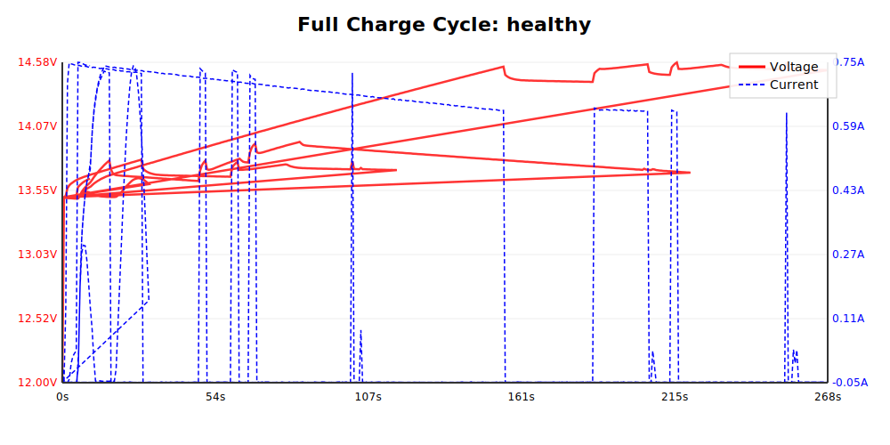
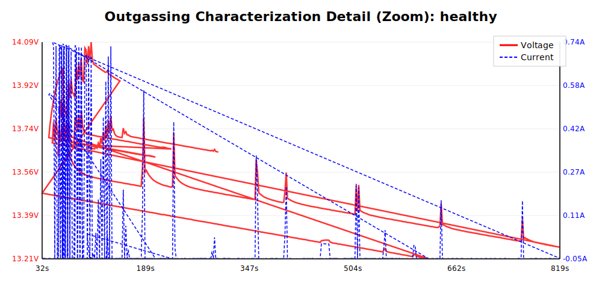
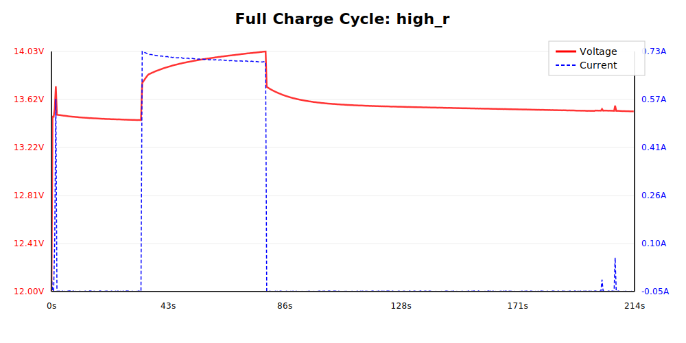
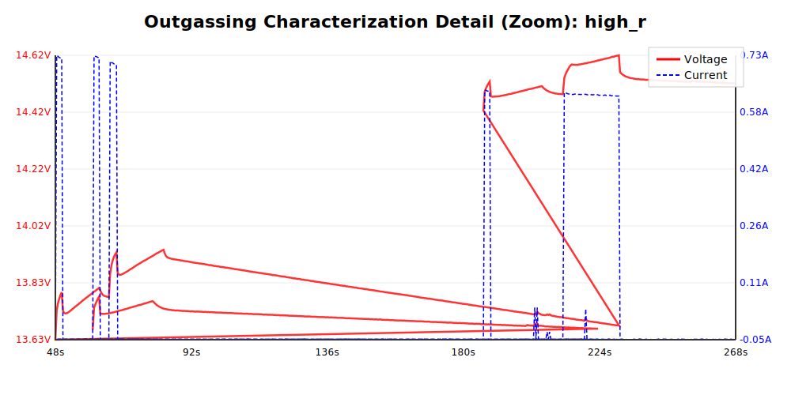
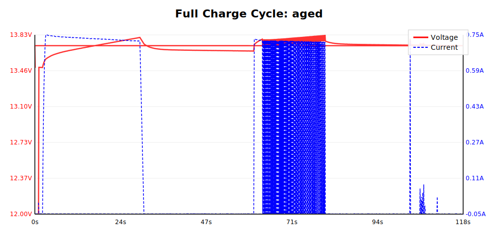
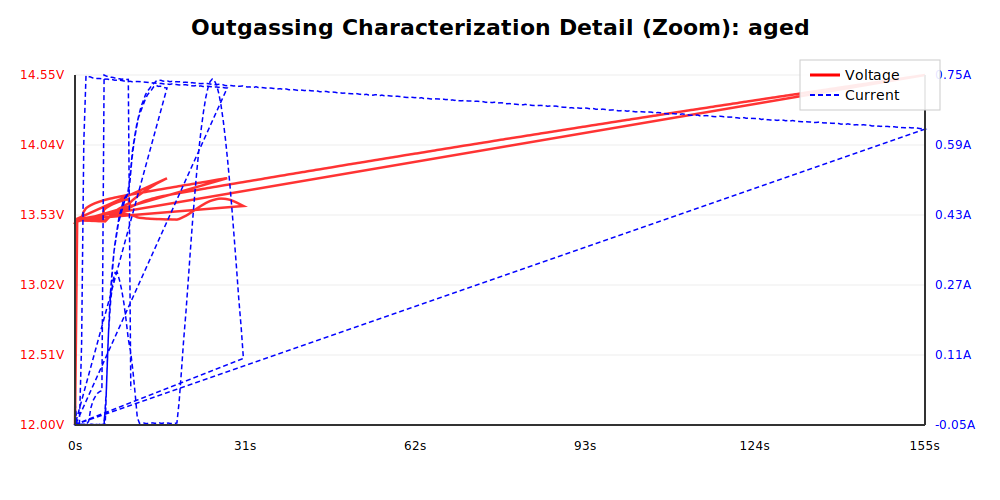
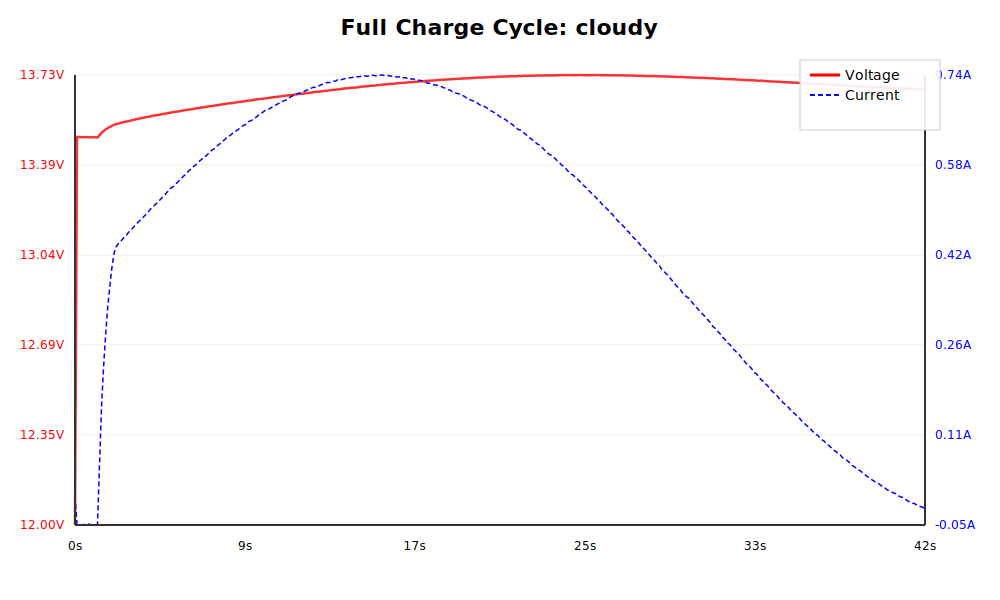
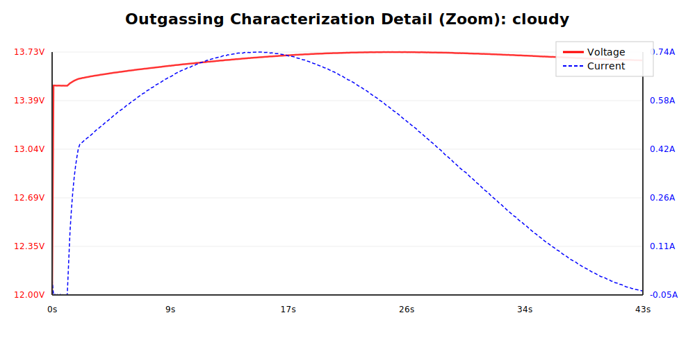
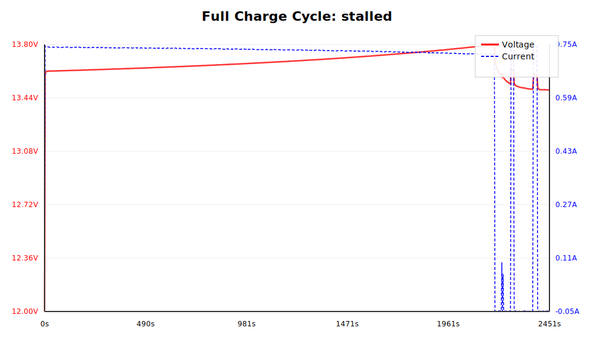

# Outgasser Firmware: Operation & Simulation Report

This document explains the charging algorithm and characterization process implemented in the `outgasser` firmware, verified through extensive simulation across various battery health scenarios.

## Charging Algorithm Flow

The firmware follows a multi-stage state machine to safely charge lead-acid batteries while identifying their specific electrochemical outgassing point.

### 1. BULK Stage (MODE 5)
- **Goal:** Charge the battery as fast as the solar conditions allow.
- **Process:** Utilizes a fractional-Voc MPPT loop. Charging continues until `BULK_TARGET_V` (default 13.8V).
- **Safety:** Includes "Stall Detection" which trips if the voltage fails to rise or drops significantly during active charging (possible shorted cell).

### 2. PARASITIC BASELINE Stage (MODE 2)
- **Goal:** Measure self-discharge and system load.
- **Process:** Holds the battery voltage slightly above idle; the current needed is recorded as the search's lower bound.

### 3. OUTGASSING CHARACTERIZATION (MODE 6)
- **Goal:** Find the minimum current triggering the "knee" of the outgassing reaction.
- **Process:** Uses a bisection search between the parasitic floor and maximum solar current. Analyzes dV/dt (via Kalman filter) and post-pulse relaxation (bi-exponential decay) to confirm the Faradaic reaction.

### 4. FLOAT Stage (MODE 7)
- **Goal:** Maintain full charge at the discovered outgassing voltage.

---

## Simulation Scenarios

### Healthy Battery
- **Full Overview:** 
- **Characterization Zoom:** 

### High Internal Resistance
- **Full Overview:** 
- **Characterization Zoom:** 

### Aged / Low Capacity
- **Full Overview:** 
- **Characterization Zoom:** 

### Cloudy Day (Variable Solar)
- **Full Overview:** 
- **Characterization Zoom:** 

### Stalled / Faulty Battery
- **Full Overview:** 
- **Result:** Bulk Stall detection correctly identified the failure and tripped a fault.
